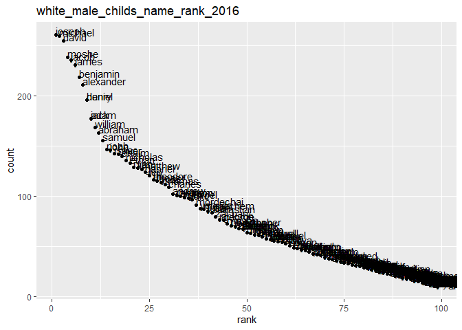

P8105\_HW2
================
Yijia Chen
2021-10-05

``` r
library(tidyverse)
library(readxl)
```

# Problem 1

## Problem 1 (1)

Read and clean the Mr. Trash Wheel sheet:

1.  specify the sheet in the Excel file and to omit non-data entries
    (rows with notes / figures; columns containing notes) using
    arguments in read\_excel
2.  use reasonable variable names
3.  omit rows that do not include dumpster-specific data
4.  round the number of sports balls to the nearest integer

``` r
trashw_df = 
  read_excel("data/Trash-Wheel-Collection-Totals-7-2020-2.xlsx", sheet = "Mr. Trash Wheel", range = "A2:N534") %>%
  janitor::clean_names() %>% 
  drop_na(dumpster) %>% 
  mutate(sports_balls = round(sports_balls))
```

    ## Warning in FUN(X[[i]], ...): strings not representable in native encoding will
    ## be translated to UTF-8

    ## Warning in FUN(X[[i]], ...): unable to translate '<U+00C4>' to native encoding

    ## Warning in FUN(X[[i]], ...): unable to translate '<U+00D6>' to native encoding

    ## Warning in FUN(X[[i]], ...): unable to translate '<U+00E4>' to native encoding

    ## Warning in FUN(X[[i]], ...): unable to translate '<U+00F6>' to native encoding

    ## Warning in FUN(X[[i]], ...): unable to translate '<U+00DF>' to native encoding

    ## Warning in FUN(X[[i]], ...): unable to translate '<U+00C6>' to native encoding

    ## Warning in FUN(X[[i]], ...): unable to translate '<U+00E6>' to native encoding

    ## Warning in FUN(X[[i]], ...): unable to translate '<U+00D8>' to native encoding

    ## Warning in FUN(X[[i]], ...): unable to translate '<U+00F8>' to native encoding

    ## Warning in FUN(X[[i]], ...): unable to translate '<U+00C5>' to native encoding

    ## Warning in FUN(X[[i]], ...): unable to translate '<U+00E5>' to native encoding

## Problem 1 (2)

Read and clean precipitation data for 2018 and 2019. For each, omit rows
without precipitation data and add a variable for year. Next, combine
precipitation datasets and convert month to a character variable.

``` r
pdata_2019_df = 
  read_excel("data/Trash-Wheel-Collection-Totals-7-2020-2.xlsx", sheet = "2019 Precipitation", range = "A2:B14") %>%   janitor::clean_names() %>% 
  mutate(year = 2019)

pdata_2018_df = 
  read_excel("data/Trash-Wheel-Collection-Totals-7-2020-2.xlsx", sheet = "2018 Precipitation", range = "A2:B14") %>%   janitor::clean_names() %>% 
  mutate(year = 2018)

pdata_df = 
  bind_rows(pdata_2018_df, pdata_2019_df) %>% 
  mutate(month = month.abb[month]) %>% 
  rename(total_precipitation = total) %>% 
  relocate(year)
```

For trashw\_df, the number of observation is `nrow(trashw_df)`. All
variables in this dataset are `names(trashw_df)`. Some key variable
examples are “weight\_tons” with a mean of
`mean(pull(trashw_df, weight_tons))` and variance as
`var(pull(trashw_df, weight_tons))`, “volume\_cubic\_yards” with a mean
of `mean(pull(trashw_df, volume_cubic_yards))` and variance as
`var(pull(trashw_df, volume_cubic_yards))`, and “plastic\_bottles” with
a mean of `mean(pull(trashw_df, plastic_bottles))` and variance as
`var(pull(trashw_df, plastic_bottles))`. The median number of sports
balls in a dumpster in 2019 is
`median(pull(filter(trashw_df, year == 2019), sports_balls))`.

For pdata\_df, the number of observation is `nrow(pdata_df)`. All
variables in this dataset are `names(pdata_df)`. “Total\_precipitation”
is the key variable here with a mean of
`mean(pull(pdata_df, total_precipitation))` and variance of
`var(pull(pdata_df, total_precipitation))`. The total precipitation in
2018 is `sum(pull(pdata_2018_df, total))`.

# Problem 2

First, clean the data in pols-month.csv. Use separate() to break up the
variable mon into integer variables year, month, and day; replace month
number with month name; create a president variable taking values gop
and dem, and remove prez\_dem and prez\_gop; and remove the day
variable.

``` r
pols_df = 
  read_csv("data/fivethirtyeight/pols-month.csv") %>% 
  janitor::clean_names() %>% 
  separate(mon, into = c("year", "month", "day")) %>% 
  mutate(
    month = as.numeric(month),
    month = month.abb[month],
    date = paste(year, month)) %>% 
  pivot_longer(
    c(prez_gop,prez_dem),
    names_to = "president",
    names_prefix = "prez_",
    values_to = "presidency"
  ) %>% 
  filter(presidency != 0) %>% 
  select(-c(year, month, day, presidency)) %>% 
  relocate(date)

pols_df
```

    ## # A tibble: 822 x 8
    ##    date     gov_gop sen_gop rep_gop gov_dem sen_dem rep_dem president
    ##    <chr>      <dbl>   <dbl>   <dbl>   <dbl>   <dbl>   <dbl> <chr>    
    ##  1 1947 Jan      23      51     253      23      45     198 dem      
    ##  2 1947 Feb      23      51     253      23      45     198 dem      
    ##  3 1947 Mar      23      51     253      23      45     198 dem      
    ##  4 1947 Apr      23      51     253      23      45     198 dem      
    ##  5 1947 May      23      51     253      23      45     198 dem      
    ##  6 1947 Jun      23      51     253      23      45     198 dem      
    ##  7 1947 Jul      23      51     253      23      45     198 dem      
    ##  8 1947 Aug      23      51     253      23      45     198 dem      
    ##  9 1947 Sep      23      51     253      23      45     198 dem      
    ## 10 1947 Oct      23      51     253      23      45     198 dem      
    ## # ... with 812 more rows

Second, clean the data in snp.csv using a similar process to the above.
For consistency across datasets, arrange according to year and month,
and organize so that year and month are the leading columns.

``` r
snp_df = 
  read.csv("data/fivethirtyeight/snp.csv") %>% 
  janitor::clean_names() %>% 
  mutate(date = lubridate::mdy(date)) %>% 
  separate(date, into = c("year", "month", "day")) %>% 
  mutate(
    year = as.numeric(year),
    year = ifelse(year > 2021, year - 100, year),
    month = as.numeric(month),
    month = month.abb[month],
    date = paste(year, month)
    ) %>% 
  select(-c(year, month, day)) %>% 
  relocate(date)

snp_df
```

    ##         date   close
    ## 1   2015 Jul 2079.65
    ## 2   2015 Jun 2063.11
    ## 3   2015 May 2107.39
    ## 4   2015 Apr 2085.51
    ## 5   2015 Mar 2067.89
    ## 6   2015 Feb 2104.50
    ## 7   2015 Jan 1994.99
    ## 8   2014 Dec 2058.90
    ## 9   2014 Nov 2067.56
    ## 10  2014 Oct 2018.05
    ## 11  2014 Sep 1972.29
    ## 12  2014 Aug 2003.37
    ## 13  2014 Jul 1930.67
    ## 14  2014 Jun 1960.23
    ## 15  2014 May 1923.57
    ## 16  2014 Apr 1883.95
    ## 17  2014 Mar 1872.34
    ## 18  2014 Feb 1859.45
    ## 19  2014 Jan 1782.59
    ## 20  2013 Dec 1848.36
    ## 21  2013 Nov 1805.81
    ## 22  2013 Oct 1756.54
    ## 23  2013 Sep 1681.55
    ## 24  2013 Aug 1632.97
    ## 25  2013 Jul 1685.73
    ## 26  2013 Jun 1606.28
    ## 27  2013 May 1630.74
    ## 28  2013 Apr 1597.57
    ## 29  2013 Mar 1569.19
    ## 30  2013 Feb 1514.68
    ## 31  2013 Jan 1498.11
    ## 32  2012 Dec 1426.19
    ## 33  2012 Nov 1416.18
    ## 34  2012 Oct 1412.16
    ## 35  2012 Sep 1440.67
    ## 36  2012 Aug 1406.58
    ## 37  2012 Jul 1379.32
    ## 38  2012 Jun 1362.16
    ## 39  2012 May 1310.33
    ## 40  2012 Apr 1397.91
    ## 41  2012 Mar 1408.47
    ## 42  2012 Feb 1365.68
    ## 43  2012 Jan 1312.41
    ## 44  2011 Dec 1257.60
    ## 45  2011 Nov 1246.96
    ## 46  2011 Oct 1253.30
    ## 47  2011 Sep 1131.42
    ## 48  2011 Aug 1218.89
    ## 49  2011 Jul 1292.28
    ## 50  2011 Jun 1320.64
    ## 51  2011 May 1345.20
    ## 52  2011 Apr 1363.61
    ## 53  2011 Mar 1325.83
    ## 54  2011 Feb 1327.22
    ## 55  2011 Jan 1286.12
    ## 56  2010 Dec 1257.64
    ## 57  2010 Nov 1180.55
    ## 58  2010 Oct 1183.26
    ## 59  2010 Sep 1141.20
    ## 60  2010 Aug 1049.33
    ## 61  2010 Jul 1101.60
    ## 62  2010 Jun 1030.71
    ## 63  2010 May 1089.41
    ## 64  2010 Apr 1186.69
    ## 65  2010 Mar 1169.43
    ## 66  2010 Feb 1104.49
    ## 67  2010 Jan 1073.87
    ## 68  2009 Dec 1115.10
    ## 69  2009 Nov 1095.63
    ## 70  2009 Oct 1036.19
    ## 71  2009 Sep 1057.08
    ## 72  2009 Aug 1020.62
    ## 73  2009 Jul  987.48
    ## 74  2009 Jun  919.32
    ## 75  2009 May  919.14
    ## 76  2009 Apr  872.81
    ## 77  2009 Mar  797.87
    ## 78  2009 Feb  735.09
    ## 79  2009 Jan  825.88
    ## 80  2008 Dec  903.25
    ## 81  2008 Nov  896.24
    ## 82  2008 Oct  968.75
    ## 83  2008 Sep 1166.36
    ## 84  2008 Aug 1282.83
    ## 85  2008 Jul 1267.38
    ## 86  2008 Jun 1280.00
    ## 87  2008 May 1400.38
    ## 88  2008 Apr 1385.59
    ## 89  2008 Mar 1322.70
    ## 90  2008 Feb 1330.63
    ## 91  2008 Jan 1378.55
    ## 92  2007 Dec 1468.36
    ## 93  2007 Nov 1481.14
    ## 94  2007 Oct 1549.38
    ## 95  2007 Sep 1526.75
    ## 96  2007 Aug 1473.99
    ## 97  2007 Jul 1455.27
    ## 98  2007 Jun 1503.35
    ## 99  2007 May 1530.62
    ## 100 2007 Apr 1482.37
    ## 101 2007 Mar 1420.86
    ## 102 2007 Feb 1406.82
    ## 103 2007 Jan 1438.24
    ## 104 2006 Dec 1418.30
    ## 105 2006 Nov 1400.63
    ## 106 2006 Oct 1377.94
    ## 107 2006 Sep 1335.85
    ## 108 2006 Aug 1303.82
    ## 109 2006 Jul 1276.66
    ## 110 2006 Jun 1270.20
    ## 111 2006 May 1270.09
    ## 112 2006 Apr 1310.61
    ## 113 2006 Mar 1294.87
    ## 114 2006 Feb 1280.66
    ## 115 2006 Jan 1280.08
    ## 116 2005 Dec 1248.29
    ## 117 2005 Nov 1249.48
    ## 118 2005 Oct 1207.01
    ## 119 2005 Sep 1228.81
    ## 120 2005 Aug 1220.33
    ## 121 2005 Jul 1234.18
    ## 122 2005 Jun 1191.33
    ## 123 2005 May 1191.50
    ## 124 2005 Apr 1156.85
    ## 125 2005 Mar 1180.59
    ## 126 2005 Feb 1203.60
    ## 127 2005 Jan 1181.27
    ## 128 2004 Dec 1211.92
    ## 129 2004 Nov 1173.82
    ## 130 2004 Oct 1130.20
    ## 131 2004 Sep 1114.58
    ## 132 2004 Aug 1104.24
    ## 133 2004 Jul 1101.72
    ## 134 2004 Jun 1140.84
    ## 135 2004 May 1120.68
    ## 136 2004 Apr 1107.30
    ## 137 2004 Mar 1126.21
    ## 138 2004 Feb 1144.94
    ## 139 2004 Jan 1131.13
    ## 140 2003 Dec 1111.92
    ## 141 2003 Nov 1058.20
    ## 142 2003 Oct 1050.71
    ## 143 2003 Sep  995.97
    ## 144 2003 Aug 1008.01
    ## 145 2003 Jul  990.31
    ## 146 2003 Jun  974.50
    ## 147 2003 May  963.59
    ## 148 2003 Apr  916.92
    ## 149 2003 Mar  848.18
    ## 150 2003 Feb  841.15
    ## 151 2003 Jan  855.70
    ## 152 2002 Dec  879.82
    ## 153 2002 Nov  936.31
    ## 154 2002 Oct  885.76
    ## 155 2002 Sep  815.28
    ## 156 2002 Aug  916.07
    ## 157 2002 Jul  911.62
    ## 158 2002 Jun  989.82
    ## 159 2002 May 1067.14
    ## 160 2002 Apr 1076.92
    ## 161 2002 Mar 1147.39
    ## 162 2002 Feb 1106.73
    ## 163 2002 Jan 1130.20
    ## 164 2001 Dec 1148.08
    ## 165 2001 Nov 1139.45
    ## 166 2001 Oct 1059.78
    ## 167 2001 Sep 1040.94
    ## 168 2001 Aug 1133.58
    ## 169 2001 Jul 1211.23
    ## 170 2001 Jun 1224.38
    ## 171 2001 May 1255.82
    ## 172 2001 Apr 1249.46
    ## 173 2001 Mar 1160.33
    ## 174 2001 Feb 1239.94
    ## 175 2001 Jan 1366.01
    ## 176 2000 Dec 1320.28
    ## 177 2000 Nov 1314.95
    ## 178 2000 Oct 1429.40
    ## 179 2000 Sep 1436.51
    ## 180 2000 Aug 1517.68
    ## 181 2000 Jul 1430.83
    ## 182 2000 Jun 1454.60
    ## 183 2000 May 1420.60
    ## 184 2000 Apr 1452.43
    ## 185 2000 Mar 1498.58
    ## 186 2000 Feb 1366.42
    ## 187 2000 Jan 1394.46
    ## 188 1999 Dec 1469.25
    ## 189 1999 Nov 1388.91
    ## 190 1999 Oct 1362.93
    ## 191 1999 Sep 1282.71
    ## 192 1999 Aug 1320.41
    ## 193 1999 Jul 1328.72
    ## 194 1999 Jun 1372.71
    ## 195 1999 May 1301.84
    ## 196 1999 Apr 1335.18
    ## 197 1999 Mar 1286.37
    ## 198 1999 Feb 1238.33
    ## 199 1999 Jan 1279.64
    ## 200 1998 Dec 1229.23
    ## 201 1998 Nov 1163.63
    ## 202 1998 Oct 1098.67
    ## 203 1998 Sep 1017.01
    ## 204 1998 Aug  957.28
    ## 205 1998 Jul 1120.67
    ## 206 1998 Jun 1133.84
    ## 207 1998 May 1090.82
    ## 208 1998 Apr 1111.75
    ## 209 1998 Mar 1101.75
    ## 210 1998 Feb 1049.34
    ## 211 1998 Jan  980.28
    ## 212 1997 Dec  970.43
    ## 213 1997 Nov  955.40
    ## 214 1997 Oct  914.62
    ## 215 1997 Sep  947.28
    ## 216 1997 Aug  899.47
    ## 217 1997 Jul  954.31
    ## 218 1997 Jun  885.14
    ## 219 1997 May  848.28
    ## 220 1997 Apr  801.34
    ## 221 1997 Mar  757.12
    ## 222 1997 Feb  790.82
    ## 223 1997 Jan  786.16
    ## 224 1996 Dec  740.74
    ## 225 1996 Nov  757.02
    ## 226 1996 Oct  705.27
    ## 227 1996 Sep  687.33
    ## 228 1996 Aug  651.99
    ## 229 1996 Jul  639.95
    ## 230 1996 Jun  670.63
    ## 231 1996 May  669.12
    ## 232 1996 Apr  654.17
    ## 233 1996 Mar  645.50
    ## 234 1996 Feb  640.43
    ## 235 1996 Jan  636.02
    ## 236 1995 Dec  615.93
    ## 237 1995 Nov  605.37
    ## 238 1995 Oct  581.50
    ## 239 1995 Sep  584.41
    ## 240 1995 Aug  561.88
    ## 241 1995 Jul  562.06
    ## 242 1995 Jun  544.75
    ## 243 1995 May  533.40
    ## 244 1995 Apr  514.71
    ## 245 1995 Mar  500.71
    ## 246 1995 Feb  487.39
    ## 247 1995 Jan  470.42
    ## 248 1994 Dec  459.27
    ## 249 1994 Nov  453.69
    ## 250 1994 Oct  472.35
    ## 251 1994 Sep  462.71
    ## 252 1994 Aug  475.49
    ## 253 1994 Jul  458.26
    ## 254 1994 Jun  444.27
    ## 255 1994 May  456.50
    ## 256 1994 Apr  450.91
    ## 257 1994 Mar  445.77
    ## 258 1994 Feb  467.14
    ## 259 1994 Jan  481.61
    ## 260 1993 Dec  466.45
    ## 261 1993 Nov  461.79
    ## 262 1993 Oct  467.83
    ## 263 1993 Sep  458.93
    ## 264 1993 Aug  463.56
    ## 265 1993 Jul  448.13
    ## 266 1993 Jun  450.53
    ## 267 1993 May  450.19
    ## 268 1993 Apr  440.19
    ## 269 1993 Mar  451.67
    ## 270 1993 Feb  443.38
    ## 271 1993 Jan  438.78
    ## 272 1992 Dec  435.71
    ## 273 1992 Nov  431.35
    ## 274 1992 Oct  418.68
    ## 275 1992 Sep  417.80
    ## 276 1992 Aug  414.03
    ## 277 1992 Jul  424.21
    ## 278 1992 Jun  408.14
    ## 279 1992 May  415.35
    ## 280 1992 Apr  414.95
    ## 281 1992 Mar  403.69
    ## 282 1992 Feb  412.70
    ## 283 1992 Jan  408.78
    ## 284 1991 Dec  417.09
    ## 285 1991 Nov  375.22
    ## 286 1991 Oct  392.45
    ## 287 1991 Sep  387.86
    ## 288 1991 Aug  395.43
    ## 289 1991 Jul  387.81
    ## 290 1991 Jun  371.16
    ## 291 1991 May  389.83
    ## 292 1991 Apr  375.34
    ## 293 1991 Mar  375.22
    ## 294 1991 Feb  367.07
    ## 295 1991 Jan  343.93
    ## 296 1990 Dec  330.22
    ## 297 1990 Nov  322.22
    ## 298 1990 Oct  304.00
    ## 299 1990 Sep  306.05
    ## 300 1990 Aug  322.56
    ## 301 1990 Jul  356.15
    ## 302 1990 Jun  358.02
    ## 303 1990 May  361.23
    ## 304 1990 Apr  330.80
    ## 305 1990 Mar  339.94
    ## 306 1990 Feb  331.89
    ## 307 1990 Jan  329.08
    ## 308 1989 Dec  353.40
    ## 309 1989 Nov  345.99
    ## 310 1989 Oct  340.36
    ## 311 1989 Sep  349.15
    ## 312 1989 Aug  351.45
    ## 313 1989 Jul  346.08
    ## 314 1989 Jun  317.98
    ## 315 1989 May  320.52
    ## 316 1989 Apr  309.64
    ## 317 1989 Mar  294.87
    ## 318 1989 Feb  288.86
    ## 319 1989 Jan  297.47
    ## 320 1988 Dec  277.72
    ## 321 1988 Nov  273.70
    ## 322 1988 Oct  278.97
    ## 323 1988 Sep  271.91
    ## 324 1988 Aug  261.52
    ## 325 1988 Jul  272.02
    ## 326 1988 Jun  273.50
    ## 327 1988 May  262.16
    ## 328 1988 Apr  261.33
    ## 329 1988 Mar  258.89
    ## 330 1988 Feb  267.82
    ## 331 1988 Jan  257.07
    ## 332 1987 Dec  247.08
    ## 333 1987 Nov  230.30
    ## 334 1987 Oct  251.79
    ## 335 1987 Sep  321.83
    ## 336 1987 Aug  329.80
    ## 337 1987 Jul  318.66
    ## 338 1987 Jun  304.00
    ## 339 1987 May  290.10
    ## 340 1987 Apr  288.36
    ## 341 1987 Mar  291.70
    ## 342 1987 Feb  284.20
    ## 343 1987 Jan  274.08
    ## 344 1986 Dec  242.17
    ## 345 1986 Nov  249.22
    ## 346 1986 Oct  243.98
    ## 347 1986 Sep  231.32
    ## 348 1986 Aug  252.93
    ## 349 1986 Jul  236.12
    ## 350 1986 Jun  250.84
    ## 351 1986 May  247.35
    ## 352 1986 Apr  235.52
    ## 353 1986 Mar  238.90
    ## 354 1986 Feb  226.92
    ## 355 1986 Jan  211.78
    ## 356 1985 Dec  211.28
    ## 357 1985 Nov  202.17
    ## 358 1985 Oct  189.82
    ## 359 1985 Sep  182.08
    ## 360 1985 Aug  188.63
    ## 361 1985 Jul  190.92
    ## 362 1985 Jun  191.85
    ## 363 1985 May  189.55
    ## 364 1985 Apr  179.83
    ## 365 1985 Mar  180.66
    ## 366 1985 Feb  181.18
    ## 367 1985 Jan  179.63
    ## 368 1984 Dec  167.24
    ## 369 1984 Nov  163.58
    ## 370 1984 Oct  166.09
    ## 371 1984 Sep  166.10
    ## 372 1984 Aug  166.68
    ## 373 1984 Jul  150.66
    ## 374 1984 Jun  153.18
    ## 375 1984 May  150.55
    ## 376 1984 Apr  160.05
    ## 377 1984 Mar  159.18
    ## 378 1984 Feb  157.06
    ## 379 1984 Jan  163.41
    ## 380 1983 Dec  164.93
    ## 381 1983 Nov  166.40
    ## 382 1983 Oct  163.55
    ## 383 1983 Sep  166.07
    ## 384 1983 Aug  164.40
    ## 385 1983 Jul  162.56
    ## 386 1983 Jun  167.64
    ## 387 1983 May  162.39
    ## 388 1983 Apr  164.43
    ## 389 1983 Mar  152.96
    ## 390 1983 Feb  148.06
    ## 391 1983 Jan  145.30
    ## 392 1982 Dec  140.64
    ## 393 1982 Nov  138.53
    ## 394 1982 Oct  133.72
    ## 395 1982 Sep  120.42
    ## 396 1982 Aug  119.51
    ## 397 1982 Jul  107.09
    ## 398 1982 Jun  109.61
    ## 399 1982 May  111.88
    ## 400 1982 Apr  116.44
    ## 401 1982 Mar  111.96
    ## 402 1982 Feb  113.11
    ## 403 1982 Jan  120.40
    ## 404 1981 Dec  122.55
    ## 405 1981 Nov  126.35
    ## 406 1981 Oct  121.89
    ## 407 1981 Sep  116.18
    ## 408 1981 Aug  122.79
    ## 409 1981 Jul  130.92
    ## 410 1981 Jun  131.21
    ## 411 1981 May  132.59
    ## 412 1981 Apr  132.81
    ## 413 1981 Mar  136.00
    ## 414 1981 Feb  131.27
    ## 415 1981 Jan  129.55
    ## 416 1980 Dec  135.76
    ## 417 1980 Nov  140.52
    ## 418 1980 Oct  127.47
    ## 419 1980 Sep  125.46
    ## 420 1980 Aug  122.38
    ## 421 1980 Jul  121.67
    ## 422 1980 Jun  114.24
    ## 423 1980 May  111.24
    ## 424 1980 Apr  106.29
    ## 425 1980 Mar  102.09
    ## 426 1980 Feb  113.66
    ## 427 1980 Jan  114.16
    ## 428 1979 Dec  107.94
    ## 429 1979 Nov  106.16
    ## 430 1979 Oct  101.82
    ## 431 1979 Sep  109.32
    ## 432 1979 Aug  109.32
    ## 433 1979 Jul  103.81
    ## 434 1979 Jun  102.91
    ## 435 1979 May   99.08
    ## 436 1979 Apr  101.76
    ## 437 1979 Mar  101.59
    ## 438 1979 Feb   96.28
    ## 439 1979 Jan   99.93
    ## 440 1978 Dec   96.11
    ## 441 1978 Nov   94.70
    ## 442 1978 Oct   93.15
    ## 443 1978 Sep  102.54
    ## 444 1978 Aug  103.29
    ## 445 1978 Jul  100.68
    ## 446 1978 Jun   95.53
    ## 447 1978 May   97.24
    ## 448 1978 Apr   96.83
    ## 449 1978 Mar   89.21
    ## 450 1978 Feb   87.04
    ## 451 1978 Jan   89.25
    ## 452 1977 Dec   95.10
    ## 453 1977 Nov   94.83
    ## 454 1977 Oct   92.34
    ## 455 1977 Sep   96.53
    ## 456 1977 Aug   96.77
    ## 457 1977 Jul   98.85
    ## 458 1977 Jun  100.48
    ## 459 1977 May   96.12
    ## 460 1977 Apr   98.44
    ## 461 1977 Mar   98.42
    ## 462 1977 Feb   99.82
    ## 463 1977 Jan  102.03
    ## 464 1976 Dec  107.46
    ## 465 1976 Nov  102.10
    ## 466 1976 Oct  102.90
    ## 467 1976 Sep  105.24
    ## 468 1976 Aug  102.91
    ## 469 1976 Jul  103.44
    ## 470 1976 Jun  104.28
    ## 471 1976 May  100.18
    ## 472 1976 Apr  101.64
    ## 473 1976 Mar  102.77
    ## 474 1976 Feb   99.71
    ## 475 1976 Jan  100.86
    ## 476 1975 Dec   90.19
    ## 477 1975 Nov   91.24
    ## 478 1975 Oct   89.04
    ## 479 1975 Sep   83.87
    ## 480 1975 Aug   86.88
    ## 481 1975 Jul   88.75
    ## 482 1975 Jun   95.19
    ## 483 1975 May   91.15
    ## 484 1975 Apr   87.30
    ## 485 1975 Mar   83.36
    ## 486 1975 Feb   81.59
    ## 487 1975 Jan   76.98
    ## 488 1974 Dec   68.56
    ## 489 1974 Nov   69.97
    ## 490 1974 Oct   73.90
    ## 491 1974 Sep   63.54
    ## 492 1974 Aug   72.15
    ## 493 1974 Jul   79.31
    ## 494 1974 Jun   86.00
    ## 495 1974 May   87.28
    ## 496 1974 Apr   90.31
    ## 497 1974 Mar   93.98
    ## 498 1974 Feb   96.22
    ## 499 1974 Jan   96.57
    ## 500 1973 Dec   97.55
    ## 501 1973 Nov   95.96
    ## 502 1973 Oct  108.29
    ## 503 1973 Sep  108.43
    ## 504 1973 Aug  104.25
    ## 505 1973 Jul  108.22
    ## 506 1973 Jun  104.26
    ## 507 1973 May  104.95
    ## 508 1973 Apr  106.97
    ## 509 1973 Mar  111.52
    ## 510 1973 Feb  111.68
    ## 511 1973 Jan  116.03
    ## 512 1972 Dec  118.05
    ## 513 1972 Nov  116.67
    ## 514 1972 Oct  111.58
    ## 515 1972 Sep  110.55
    ## 516 1972 Aug  111.09
    ## 517 1972 Jul  107.39
    ## 518 1972 Jun  107.14
    ## 519 1972 May  109.53
    ## 520 1972 Apr  107.67
    ## 521 1972 Mar  107.20
    ## 522 1972 Feb  106.57
    ## 523 1972 Jan  103.94
    ## 524 1971 Dec  102.09
    ## 525 1971 Nov   93.99
    ## 526 1971 Oct   94.23
    ## 527 1971 Sep   98.34
    ## 528 1971 Aug   99.03
    ## 529 1971 Jul   95.58
    ## 530 1971 Jun   98.70
    ## 531 1971 May   99.63
    ## 532 1971 Apr  103.95
    ## 533 1971 Mar  100.31
    ## 534 1971 Feb   96.75
    ## 535 1971 Jan   95.88
    ## 536 1970 Dec   92.15
    ## 537 1970 Nov   87.20
    ## 538 1970 Oct   83.25
    ## 539 1970 Sep   84.30
    ## 540 1970 Aug   81.52
    ## 541 1970 Jul   78.05
    ## 542 1970 Jun   72.72
    ## 543 1970 May   76.55
    ## 544 1970 Apr   81.52
    ## 545 1970 Mar   89.63
    ## 546 1970 Feb   89.50
    ## 547 1970 Jan   85.02
    ## 548 1969 Dec   92.06
    ## 549 1969 Nov   93.81
    ## 550 1969 Oct   97.12
    ## 551 1969 Sep   93.12
    ## 552 1969 Aug   95.51
    ## 553 1969 Jul   91.83
    ## 554 1969 Jun   97.71
    ## 555 1969 May  103.46
    ## 556 1969 Apr  103.69
    ## 557 1969 Mar  101.51
    ## 558 1969 Feb   98.13
    ## 559 1969 Jan  103.01
    ## 560 1968 Dec  103.86
    ## 561 1968 Nov  108.37
    ## 562 1968 Oct  103.41
    ## 563 1968 Sep  102.67
    ## 564 1968 Aug   98.86
    ## 565 1968 Jul   97.74
    ## 566 1968 Jun   99.58
    ## 567 1968 May   98.68
    ## 568 1968 Apr   97.46
    ## 569 1968 Mar   90.20
    ## 570 1968 Feb   89.36
    ## 571 1968 Jan   92.24
    ## 572 1967 Dec   96.47
    ## 573 1967 Nov   94.00
    ## 574 1967 Oct   93.30
    ## 575 1967 Sep   96.71
    ## 576 1967 Aug   93.64
    ## 577 1967 Jul   94.75
    ## 578 1967 Jun   90.64
    ## 579 1967 May   89.08
    ## 580 1967 Apr   94.01
    ## 581 1967 Mar   90.20
    ## 582 1967 Feb   86.78
    ## 583 1967 Jan   86.61
    ## 584 1966 Dec   80.33
    ## 585 1966 Nov   80.45
    ## 586 1966 Oct   80.20
    ## 587 1966 Sep   76.56
    ## 588 1966 Aug   77.10
    ## 589 1966 Jul   83.60
    ## 590 1966 Jun   84.74
    ## 591 1966 May   86.13
    ## 592 1966 Apr   91.06
    ## 593 1966 Mar   89.23
    ## 594 1966 Feb   91.22
    ## 595 1966 Jan   92.88
    ## 596 1965 Dec   92.43
    ## 597 1965 Nov   91.61
    ## 598 1965 Oct   92.42
    ## 599 1965 Sep   89.96
    ## 600 1965 Aug   87.17
    ## 601 1965 Jul   85.25
    ## 602 1965 Jun   84.12
    ## 603 1965 May   88.42
    ## 604 1965 Apr   89.11
    ## 605 1965 Mar   86.16
    ## 606 1965 Feb   87.43
    ## 607 1965 Jan   87.56
    ## 608 1964 Dec   84.75
    ## 609 1964 Nov   84.42
    ## 610 1964 Oct   84.86
    ## 611 1964 Sep   84.18
    ## 612 1964 Aug   81.83
    ## 613 1964 Jul   83.18
    ## 614 1964 Jun   81.69
    ## 615 1964 May   80.37
    ## 616 1964 Apr   79.46
    ## 617 1964 Mar   78.98
    ## 618 1964 Feb   77.80
    ## 619 1964 Jan   77.04
    ## 620 1963 Dec   75.02
    ## 621 1963 Nov   73.23
    ## 622 1963 Oct   74.01
    ## 623 1963 Sep   71.70
    ## 624 1963 Aug   72.50
    ## 625 1963 Jul   69.13
    ## 626 1963 Jun   69.37
    ## 627 1963 May   70.80
    ## 628 1963 Apr   69.80
    ## 629 1963 Mar   66.57
    ## 630 1963 Feb   64.29
    ## 631 1963 Jan   66.20
    ## 632 1962 Dec   63.10
    ## 633 1962 Nov   62.26
    ## 634 1962 Oct   56.52
    ## 635 1962 Sep   56.27
    ## 636 1962 Aug   59.12
    ## 637 1962 Jul   58.23
    ## 638 1962 Jun   54.75
    ## 639 1962 May   59.63
    ## 640 1962 Apr   65.24
    ## 641 1962 Mar   69.55
    ## 642 1962 Feb   69.96
    ## 643 1962 Jan   68.84
    ## 644 1961 Dec   71.55
    ## 645 1961 Nov   71.32
    ## 646 1961 Oct   68.62
    ## 647 1961 Sep   66.73
    ## 648 1961 Aug   68.07
    ## 649 1961 Jul   66.76
    ## 650 1961 Jun   64.64
    ## 651 1961 May   66.56
    ## 652 1961 Apr   65.31
    ## 653 1961 Mar   65.06
    ## 654 1961 Feb   63.44
    ## 655 1961 Jan   61.78
    ## 656 1960 Dec   58.11
    ## 657 1960 Nov   55.54
    ## 658 1960 Oct   53.39
    ## 659 1960 Sep   53.52
    ## 660 1960 Aug   56.96
    ## 661 1960 Jul   55.51
    ## 662 1960 Jun   56.92
    ## 663 1960 May   55.83
    ## 664 1960 Apr   54.37
    ## 665 1960 Mar   55.34
    ## 666 1960 Feb   56.12
    ## 667 1960 Jan   55.61
    ## 668 1959 Dec   59.89
    ## 669 1959 Nov   58.28
    ## 670 1959 Oct   57.52
    ## 671 1959 Sep   56.88
    ## 672 1959 Aug   59.60
    ## 673 1959 Jul   60.51
    ## 674 1959 Jun   58.47
    ## 675 1959 May   58.68
    ## 676 1959 Apr   57.59
    ## 677 1959 Mar   55.44
    ## 678 1959 Feb   55.41
    ## 679 1959 Jan   55.45
    ## 680 1958 Dec   55.21
    ## 681 1958 Nov   52.48
    ## 682 1958 Oct   51.33
    ## 683 1958 Sep   50.06
    ## 684 1958 Aug   47.75
    ## 685 1958 Jul   47.19
    ## 686 1958 Jun   45.24
    ## 687 1958 May   44.09
    ## 688 1958 Apr   43.44
    ## 689 1958 Mar   42.10
    ## 690 1958 Feb   40.84
    ## 691 1958 Jan   41.70
    ## 692 1957 Dec   39.99
    ## 693 1957 Nov   41.72
    ## 694 1957 Oct   41.06
    ## 695 1957 Sep   42.42
    ## 696 1957 Aug   45.22
    ## 697 1957 Jul   47.91
    ## 698 1957 Jun   47.37
    ## 699 1957 May   47.43
    ## 700 1957 Apr   45.74
    ## 701 1957 Mar   44.11
    ## 702 1957 Feb   43.26
    ## 703 1957 Jan   44.72
    ## 704 1956 Dec   46.67
    ## 705 1956 Nov   45.08
    ## 706 1956 Oct   45.58
    ## 707 1956 Sep   45.35
    ## 708 1956 Aug   47.51
    ## 709 1956 Jul   49.39
    ## 710 1956 Jun   46.97
    ## 711 1956 May   45.20
    ## 712 1956 Apr   48.38
    ## 713 1956 Mar   48.48
    ## 714 1956 Feb   45.34
    ## 715 1956 Jan   43.82
    ## 716 1955 Dec   45.48
    ## 717 1955 Nov   45.51
    ## 718 1955 Oct   42.34
    ## 719 1955 Sep   43.67
    ## 720 1955 Aug   43.18
    ## 721 1955 Jul   43.52
    ## 722 1955 Jun   41.03
    ## 723 1955 May   37.91
    ## 724 1955 Apr   37.96
    ## 725 1955 Mar   36.58
    ## 726 1955 Feb   36.76
    ## 727 1955 Jan   36.63
    ## 728 1954 Dec   35.98
    ## 729 1954 Nov   34.24
    ## 730 1954 Oct   31.68
    ## 731 1954 Sep   32.31
    ## 732 1954 Aug   29.83
    ## 733 1954 Jul   30.88
    ## 734 1954 Jun   29.21
    ## 735 1954 May   29.19
    ## 736 1954 Apr   28.26
    ## 737 1954 Mar   26.94
    ## 738 1954 Feb   26.15
    ## 739 1954 Jan   26.08
    ## 740 1953 Dec   24.81
    ## 741 1953 Nov   24.76
    ## 742 1953 Oct   24.54
    ## 743 1953 Sep   23.35
    ## 744 1953 Aug   23.32
    ## 745 1953 Jul   24.75
    ## 746 1953 Jun   24.14
    ## 747 1953 May   24.54
    ## 748 1953 Apr   24.62
    ## 749 1953 Mar   25.29
    ## 750 1953 Feb   25.90
    ## 751 1953 Jan   26.38
    ## 752 1952 Dec   26.57
    ## 753 1952 Nov   25.66
    ## 754 1952 Oct   24.52
    ## 755 1952 Sep   24.54
    ## 756 1952 Aug   25.03
    ## 757 1952 Jul   25.40
    ## 758 1952 Jun   24.96
    ## 759 1952 May   23.86
    ## 760 1952 Apr   23.32
    ## 761 1952 Mar   24.37
    ## 762 1952 Feb   23.26
    ## 763 1952 Jan   24.14
    ## 764 1951 Dec   23.77
    ## 765 1951 Nov   22.88
    ## 766 1951 Oct   22.94
    ## 767 1951 Sep   23.26
    ## 768 1951 Aug   23.28
    ## 769 1951 Jul   22.40
    ## 770 1951 Jun   20.96
    ## 771 1951 May   21.52
    ## 772 1951 Apr   22.43
    ## 773 1951 Mar   21.48
    ## 774 1951 Feb   21.80
    ## 775 1951 Jan   21.66
    ## 776 1950 Dec   20.43
    ## 777 1950 Nov   19.51
    ## 778 1950 Oct   19.53
    ## 779 1950 Sep   19.45
    ## 780 1950 Aug   18.42
    ## 781 1950 Jul   17.84
    ## 782 1950 Jun   17.69
    ## 783 1950 May   18.78
    ## 784 1950 Apr   17.96
    ## 785 1950 Mar   17.29
    ## 786 1950 Feb   17.22
    ## 787 1950 Jan   17.05

Third, tidy the unemployment data so that it can be merged with the
previous datasets. This process will involve switching from “wide” to
“long” format; ensuring that key variables have the same name; and
ensuring that key variables take the same values.

``` r
unemploy_df = 
  read.csv("data/fivethirtyeight/unemployment.csv") %>% 
  pivot_longer(
    c(Jan:Dec),
    names_to = "month",
    values_to = "percent_unemploy"
  ) %>% 
  janitor::clean_names() %>% 
  mutate(date = paste(year, month)) %>% 
  select(-c(year, month)) %>% 
  relocate(date)

unemploy_df
```

    ## # A tibble: 816 x 2
    ##    date     percent_unemploy
    ##    <chr>               <dbl>
    ##  1 1948 Jan              3.4
    ##  2 1948 Feb              3.8
    ##  3 1948 Mar              4  
    ##  4 1948 Apr              3.9
    ##  5 1948 May              3.5
    ##  6 1948 Jun              3.6
    ##  7 1948 Jul              3.6
    ##  8 1948 Aug              3.9
    ##  9 1948 Sep              3.8
    ## 10 1948 Oct              3.7
    ## # ... with 806 more rows

Join the datasets by merging snp into pols, and merging unemployment
into the result.

``` r
union2_df = 
  full_join(pols_df, snp_df, by = "date")

union3_df = 
  full_join(union2_df, unemploy_df, by = "date")

union3_df
```

    ## # A tibble: 828 x 10
    ##    date     gov_gop sen_gop rep_gop gov_dem sen_dem rep_dem president close
    ##    <chr>      <dbl>   <dbl>   <dbl>   <dbl>   <dbl>   <dbl> <chr>     <dbl>
    ##  1 1947 Jan      23      51     253      23      45     198 dem          NA
    ##  2 1947 Feb      23      51     253      23      45     198 dem          NA
    ##  3 1947 Mar      23      51     253      23      45     198 dem          NA
    ##  4 1947 Apr      23      51     253      23      45     198 dem          NA
    ##  5 1947 May      23      51     253      23      45     198 dem          NA
    ##  6 1947 Jun      23      51     253      23      45     198 dem          NA
    ##  7 1947 Jul      23      51     253      23      45     198 dem          NA
    ##  8 1947 Aug      23      51     253      23      45     198 dem          NA
    ##  9 1947 Sep      23      51     253      23      45     198 dem          NA
    ## 10 1947 Oct      23      51     253      23      45     198 dem          NA
    ## # ... with 818 more rows, and 1 more variable: percent_unemploy <dbl>

## Problem 3

Load and tidy the data. Note that, although these data may seem fairly
well formatted initially, the names of a categorical predictor and the
case structure of string variables changed over time; you’ll need to
address this in your data cleaning. Also, some rows seem duplicated, and
these will need to be removed.

``` r
pbname_df = 
  read_csv("data/Popular_Baby_Names.csv") %>% 
  janitor::clean_names() %>% 
  mutate(childs_first_name = str_to_lower(childs_first_name),
         ethnicity = replace(ethnicity, ethnicity == "ASIAN AND PACI", "ASIAN AND PACIFIC ISLANDER"),
         ethnicity = replace(ethnicity, ethnicity == "BLACK NON HISP", "BLACK NON HISPANIC"),
         ethnicity = replace(ethnicity, ethnicity == "WHITE NON HISP", "WHITE NON HISPANIC")) %>% 
  distinct()

pbname_df
```

    ## # A tibble: 12,181 x 6
    ##    year_of_birth gender ethnicity                  childs_first_name count  rank
    ##            <dbl> <chr>  <chr>                      <chr>             <dbl> <dbl>
    ##  1          2016 FEMALE ASIAN AND PACIFIC ISLANDER olivia              172     1
    ##  2          2016 FEMALE ASIAN AND PACIFIC ISLANDER chloe               112     2
    ##  3          2016 FEMALE ASIAN AND PACIFIC ISLANDER sophia              104     3
    ##  4          2016 FEMALE ASIAN AND PACIFIC ISLANDER emily                99     4
    ##  5          2016 FEMALE ASIAN AND PACIFIC ISLANDER emma                 99     4
    ##  6          2016 FEMALE ASIAN AND PACIFIC ISLANDER mia                  79     5
    ##  7          2016 FEMALE ASIAN AND PACIFIC ISLANDER charlotte            59     6
    ##  8          2016 FEMALE ASIAN AND PACIFIC ISLANDER sarah                57     7
    ##  9          2016 FEMALE ASIAN AND PACIFIC ISLANDER isabella             56     8
    ## 10          2016 FEMALE ASIAN AND PACIFIC ISLANDER hannah               56     8
    ## # ... with 12,171 more rows

Produce a well-structured, reader-friendly table showing the rank in
popularity of the name “Olivia” as a female baby name over time; this
should have rows for ethnicities and columns for year.

``` r
olivia_df = 
  filter(
    pbname_df,
    gender == "FEMALE",
    childs_first_name == "olivia"
  ) %>% 
  select(year_of_birth, ethnicity, rank) %>% 
  pivot_wider(
    names_from = "year_of_birth", 
    values_from = "rank"
  ) %>% 
  knitr::kable(caption = "childs_name_olivia_rank_overtime_female")

olivia_df
```

| ethnicity                  | 2016 | 2015 | 2014 | 2013 | 2012 | 2011 |
|:---------------------------|-----:|-----:|-----:|-----:|-----:|-----:|
| ASIAN AND PACIFIC ISLANDER |    1 |    1 |    1 |    3 |    3 |    4 |
| BLACK NON HISPANIC         |    8 |    4 |    8 |    6 |    8 |   10 |
| HISPANIC                   |   13 |   16 |   16 |   22 |   22 |   18 |
| WHITE NON HISPANIC         |    1 |    1 |    1 |    1 |    4 |    2 |

childs\_name\_olivia\_rank\_overtime\_female

Produce a similar table showing the most popular name among male
children over time.

``` r
popular_df = 
  select(pbname_df, -count) %>% 
  filter(
    gender == "MALE",
    rank == "1"
  ) %>% 
  pivot_wider(
    names_from = "year_of_birth",
    values_from = "childs_first_name"
  ) %>% 
  select(-c(rank, gender)) %>% 
  knitr::kable(caption = "most_popular_childs_name_overtime_male")

popular_df
```

| ethnicity                  | 2016   | 2015   | 2014   | 2013   | 2012   | 2011    |
|:---------------------------|:-------|:-------|:-------|:-------|:-------|:--------|
| ASIAN AND PACIFIC ISLANDER | ethan  | jayden | jayden | jayden | ryan   | ethan   |
| BLACK NON HISPANIC         | noah   | noah   | ethan  | ethan  | jayden | jayden  |
| HISPANIC                   | liam   | liam   | liam   | jayden | jayden | jayden  |
| WHITE NON HISPANIC         | joseph | david  | joseph | david  | joseph | michael |

most\_popular\_childs\_name\_overtime\_male

Finally, for male, white non-hispanic children born in 2016, produce a
scatter plot showing the number of children with a name (y axis) against
the rank in popularity of that name (x axis).

``` r
whitem_df = 
  filter(
    pbname_df,
    gender == "MALE",
    ethnicity == "WHITE NON HISPANIC",
    year_of_birth == 2016
  ) %>% 
  ggplot(label = "white_male_children_name_rank_2016", aes(x = rank, y = count)) + 
  geom_point() + 
  geom_text(aes(label = childs_first_name), hjust = 0, vjust = 0)

whitem_df
```

<!-- -->
